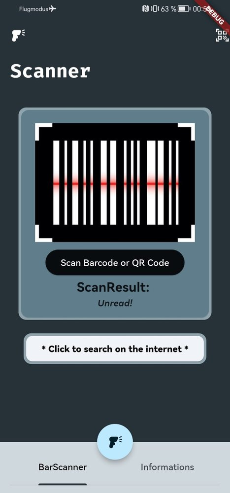
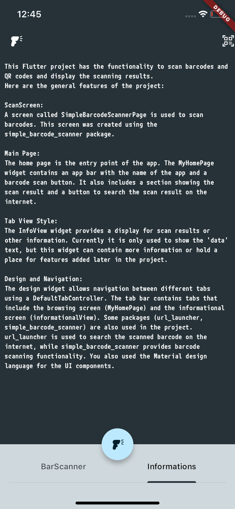

# barkodscanner

*In this Flutter application, the simple_barcode_scanner library is used to scan QR and barcodes and search them from the internet.
*BarcodeScanner is a simple and beautiful wrapper around the camera with barcode capturing functionality and a great user experience.

## Screenshorts

  
  
  
  
  

